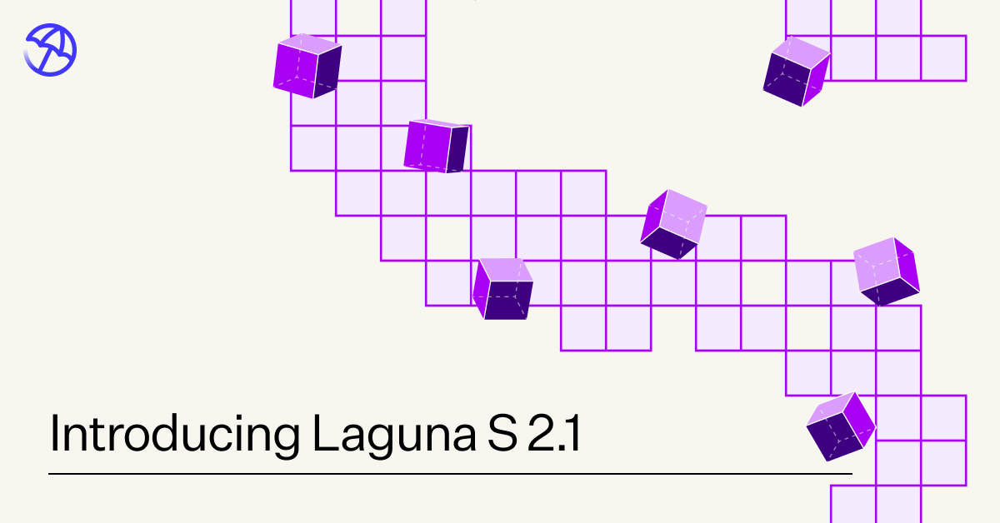
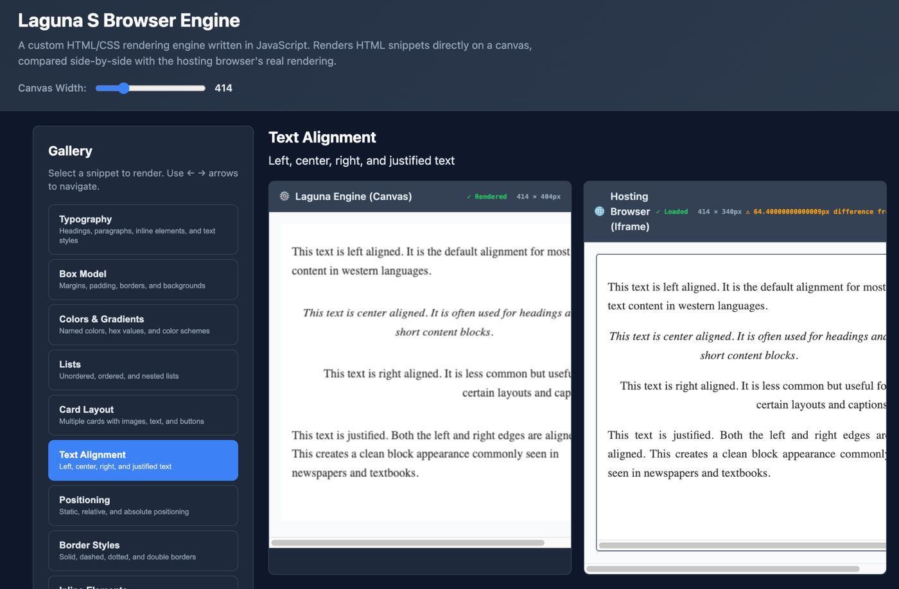

# Poolside Laguna S 2.1 深度解读报告

> **报告性质**：基于官方发布材料、权威媒体报道与社区用户实测反馈的第三方解读
> **资料来源**：Poolside 官方博客、VentureBeat、Hugging Face、Reddit r/LocalLLaMA、Medium、Kie.ai 等（详见文末来源列表）
> **撰写日期**：2026-09-11
> **图片位置**：`laguna_s21/images/`

---

---

## 一、模型概况：小参数量级上的长时程代码智能体

Laguna S 2.1 是 Poolside 于 2026 年 7 月 21 日发布的开源权重代码大模型，其技术规格呈现出鲜明的"效率优先"取向：

| 维度 | 规格 |
|---|---|
| 架构 | Mixture-of-Experts（MoE，混合专家） |
| 总参数量 | 118B |
| 每 token 激活参数 | 8B |
| 上下文窗口 | 1M tokens（思考/非思考模式均支持） |
| 训练周期 | 2026-05-22 启动预训练，约 9 周后发布 |
| 开源协议 | OpenMDW-1.1（宽许可） |
| 权重精度 | BF16 / FP8 / INT4 / NVFP4，官方 GGUF 与 MLX 转换，附 DFlash 投机解码草稿模型 |
| 参考定价 | OpenRouter 1M 上下文端点：$0.10 输入 / $0.20 输出 / $0.01 缓存读取（每百万 token） |

从工程角度看，该模型有三个值得注意的设计决策：

1. **极低激活比（8B/118B ≈ 6.8%）**：这使得推理成本接近一个 8B 稠密模型，同时保留 118B 级别的知识容量，是其在本地部署场景（单台 NVIDIA DGX Spark 即可运行）中具备可行性的根本前提。
2. **1M 上下文与长思考协同**：官方观察到的思考序列可达数十万 token（DeepSWE 任务中平均完成 token 约 249k），1M 上下文并非营销数字，而是支撑长时程推理的实际基础设施。
3. **极高的发布节奏**：从 4 月的 Laguna M.1（225B-A23B）到 7 月初的 XS 2.1（33B-A3B）再到 S 2.1，三个月内三连发，反映出其"Model Factory"工业化研发管线已趋于成熟。

---

## 二、性能评估：以小搏大的实证数据

### 2.1 六大基准测试横向对比

以下数据来自 Poolside 官方评估（自研 agent harness「pool」，thinking 模式启用，pass@1 取多次尝试均值；除注明外为 4 次尝试）：

| 基准测试 | Laguna S 2.1 (118B-A8B) | Tencent Hy3 (295B-A21B) | Inkling (975B-A41B) | DeepSeek-V4-Pro-Max (1.6T-A49B) | Kimi K3 (2.8T-A50B) | Claude Fable 5 |
|---|---|---|---|---|---|---|
| Terminal-Bench 2.1 | **70.2** | 71.7 | 63.8 | 64.0 | 88.3 | 88.0 |
| SWE-Bench Multilingual | **78.5** | 75.8 | — | 76.2 | — | — |
| SWE-Bench Pro (Public) | **59.4** | 57.9 | 54.3 | 55.4 | — | 80.3 |
| DeepSWE v1.1（3 次尝试） | **40.4** | — | — | 9.0 | 69.0 | 70.0 |
| SWE Atlas (Codebase QnA) | **46.2** | — | — | 27.2 | — | — |
| Toolathlon Verified | **49.7** | — | 45.5 | 55.9 | — | — |

**解读要点：**

- **Terminal-Bench 2.1（70.2%）是本次发布的核心战绩**。在该 Compiled Leaderboard 上，Laguna S 2.1 位列第 11，但其总参数量仅为相邻排名模型的 1/5 至 1/24：它以 118B 的体量压过了 1.6T 的 DeepSeek-V4-Pro-Max（64.0）、975B 的 Inkling（63.8）与 550B 的 Nemotron 3 Ultra（56.4），仅以 1.5 分之差落后于 295B 的腾讯 Hy3（71.7）。若以"单位参数产出"衡量，这是当期开源模型中效率最突出的成绩。
- **SWE-Bench Multilingual（78.5%）为该模型在官方对比表中的最高分项**，超过 Hy3（75.8）与 DeepSeek-V4-Pro-Max（76.2），说明其多语言代码修复能力达到同级最优。
- **DeepSWE（40.4%）需谨慎解读**。Poolside 使用自研 harness 而非官方 mini-swe-agent，官方坦承这会降低可比性，但同时指出多数模型在 mini-swe-agent 中得分持平或更高。DeepSWE 的区分度价值在于：头部模型集中在 54%–73%，而部分 1T+ 开源模型低于 10%（DeepSeek-V4-Pro-Max 仅 9.0%），Laguna S 2.1 的 40.4% 稳居第一梯队之下、腰部之上。
- **评估方法论的透明度是加分项**：Poolside 公布了全部评估轨迹（trajectories.poolside.ai），并披露了针对 reward hacking 的对抗性审查流程（详见第五节），这在开源模型发布中尚属少见。

### 2.2 思考模式的边际收益

Laguna S 2.1 提供 off / max 两档思考模式（默认 max，暂无 low/medium/high 分级），测试时计算（test-time compute）带来的提升幅度显著：

| 基准 | 非思考模式 | 思考模式 | 提升 | 平均完成 token（非思考→思考） |
|---|---|---|---|---|
| Terminal-Bench 2.1 | 60.4% | 70.2% | +9.8 pts | 80k → 129k |
| DeepSWE | 16.5% | 40.4% | +23.9 pts | 99k → 249k |
| SWE-Bench Multilingual | ~71 | ~79 | +8 pts | 23k → 101k |
| SWE-Bench Pro | ~53 | ~59 | +6 pts | 24k → 141k |

**解读**：DeepSWE 上近 24 分的提升幅度表明，该模型的内部独白（internal monologue）对高难度长时程任务尤为有效——官方称其为"迄今我们所训练的模型中，思考与非思考模式差异最大的一个"。代价是 token 消耗呈数倍增长，用户在成本敏感场景下需要权衡。

---

## 三、优势分析：超越参数规模的能力维度

### 3.1 参数效率与本地部署可行性

118B 总参数 / 8B 激活的配置，配合 NVFP4 / INT4 量化与官方 GGUF/MLX 转换，使其成为目前可在单机（含 NVIDIA DGX Spark）上运行的最强代码智能体之一。官方与 NVIDIA 合作完成了从 Blackwell 系统 TRT-LLM 服务到 DGX Spark 的全栈推理优化；配合 DFlash 投机解码，单流解码速度在 RTX 6000 PRO 上可从约 109 tok/s 提升至 271 tok/s。

### 3.2 持久性与验证行为：被刻意训练出的"工作风格"

Poolside 官方对本次发布有一个关键判断——**模型能力的提升不仅来自"更聪明"，更来自"更好的工作方式"**：

> "我们在模型中做的并非单纯增加智能，而是改进那些使模型更具能力的行为：更多验证、更少想当然、不过早宣布胜利、更加坚持不懈。"

这一理念在训练管线上有明确落点：更宽松的 rollout 预算（更长超时、更多轮次）、全新沙箱基础设施（支持后台进程与选择性断网）、多 harness 混合 rollout（避免对单一脚手架过拟合）。

### 3.3 评估透明度

发布全部最终评估轨迹、披露 reward hacking 检测流程、公开 harness 差异对可比性的影响——这种"激进透明"策略（VentureBeat 语）在竞争激烈的模型发布环境中构成差异化信任资产。

---

## 四、定位研判：Poolside 的战略意图

### 4.1 产品定位

Laguna S 2.1 是一款**面向长时程代理式编码（agentic coding for long-horizon work）的专用模型**，而非通用助手。其目标场景包括：

- 终端环境中的多步工程任务（Terminal-Bench 类）
- 大规模代码库理解与问答（SWE Atlas 类）
- 自主优化循环与持续迭代（官方 harness 自优化案例）
- 数学推导与形式化问题求解（Erdős 问题案例）

### 4.2 竞争坐标

- **对上**：与 1T+ 前沿模型（Kimi K3、Claude Fable 5、GPT-5.6 系列）存在明显差距（TB 2.1 上 70.2 vs 88+），但在开源可部署模型中位居第一梯队。
- **对同级**：全面领先同尺寸开源模型（Qwen3.6-27B：51.3；Mistral Small 4：21.4），领先幅度近 20 分。
- **对自家产品线**：相对 XS 2.1（33B-A3B，33.4）实现量级跃升；预训练数据与 XS 2.1 完全一致，提升来自规模放大、训练代码修复与后训练配方——特别是首次采用 FP8 精度强化学习。

### 4.3 战略叙事

Poolside 明确押注两条路径：其一，通往智能的道路穿过编码能力与软件接口；其二，互联网记录的是答案而非思考过程，强化学习可以"解压缩"（decompress）出被省略的思考。Laguna S 2.1 是第一条路径的阶段性证据；后者仍在研发中。

---

## 五、标志性案例：官方展示的三项能力实证

### 5.1 从空目录构建浏览器引擎（资源fulness 的体现）

50 分钟、181 步、零人工干预，模型在沙箱中用原生 JavaScript 完成了 parser → cascade → layout → renderer 的完整管线。由于模型自身不具备视觉能力，它无法直接"看"渲染结果，于是自行启动 headless Chromium 读取 canvas 并以数值方式比对截图——用间接手段完成了自我验证闭环。

### 5.2 优化自家 agent harness（真实工程能力）

在自动化研究循环中，模型对 Poolside 生产用 harness 实施了 20 轮优化尝试：发现流式 token 累积中的 O(n²) 字符串拼接并改为缓冲区、通过记忆化与预分配消除冗余拷贝。最终成果：**墙钟时间降低 5.19%，内存分配降低 71.1%**。更值得注意的是其行为特征——当速度优化的边际收益变得难以测量后，模型自主转向内存维度继续推进，并通过了 Go race detector 与 `go vet` 门控验证，排除了以竞态条件换取性能的可能。

### 5.3 独立重推 Erdős 问题 #397（数学推理上限）

该猜想自 1975 年提出，悬置逾 50 年，2026 年 1 月由 GPT-5.2 Pro 首次解决。Laguna S 2.1 在沙箱无 Python 的条件下发现 Perl 可用，完成了精确质因数分解、模式分析到构造性证明的全过程，得出与已知六指标族**结构不同**的八指标无限解族。由于模型知识截止于 2025 年 11 月，可确认这是独立重发现而非复述——证明其具备真正的原创推导能力，尽管结果性质是重发现而非首解。

---

## 六、用户评价与社区口碑：分歧明显的真实画像

### 6.1 Reddit r/LocalLLaMA 社区反馈（多条主题汇总）

**正面评价：**

- **"I'm impressed by Laguna S 2.1"**：认可其编码潜力出众，但同帖指出"推理循环造成主要问题"——过度思考在交互式场景中成为负担。
- **"How are we feeling about Poolside's Laguna S 2.1?"**：有用户总结其"几乎是一个纯粹的编码模型，而且非常擅长；我不会拿它做任何其他事"。这印证了专用模型的窄而深特征。
- **使用数周"效果很好"的持续正反馈**，以及针对早期 chat template / GGUF 兼容问题的快速修复公告。

**负面评价：**

- **"Honest take on Laguna S2.1 and its uses (from actual use)"**：实测用户认为"Laguna 并不是我期望的 planner，它的推理风格过于深入，难以有效执行这类工作"，并在部分任务上挣扎；亦有观点认为其表现逊于 Qwen 3.6 27B 与 Gemma 4 31B。
- **"Laguna-S-2.1 Failed Basic Intelligence Litmus Test"**：有用户指出其在基础常识性测试中失败，暗示通用能力存在短板。
- **"PSA on Laguna S-2.1"**：社区曾出现使用过时 chat template / GGUF 导致效果打折的问题，后经修复——提示本地部署的工程细节对实测体验影响显著。

### 6.2 第三方媒体与博客

- **VentureBeat（Michael Nuñez）**：定性其为"开源权重编码模型击败十倍于己的对手"，强调 Poolside 以透明度而非规模竞争的战略选择，并肯定轨迹公开的做法。
- **Medium（Data Science in Your Pocket）**：确认其 40.4% DeepSWE 在开源阵营领先，同时客观指出仍落后于 Claude Fable 5、Kimi K3 与 GPT-5.6 系列；补充了 DFlash 解码加速（109 → 271 tok/s）等推理端细节。
- **Kie.ai**：提供与 Hy3 / Inkling / DeepSeek 的基准对比速查表，数据与官方一致。
- **YouTube 评测**（"Laguna S 2.1: The Best Local Agentic Coder?"）：聚焦"本地最强代理式编码器"命题，讨论本地部署可行性。

### 6.3 口碑综合研判

社区评价呈现清晰的**场景分化**：

1. 在其主战场（终端编码、agentic 工作流、充分放开的思考预算）中，用户评价普遍积极，与基准数据互相印证；
2. 在通用推理、规划（planner 角色）、低延迟交互场景中，负面反馈集中——**过度思考**是最被诟病的一点，与官方自认的"thinking duration 过长"局限完全吻合；
3. 部分负面体验可归因于部署层面的 chat template / GGUF 版本问题，而非模型本身，该类问题发布后已修复。

因此，"worse than Qwen 3.6 27B"与"I'm impressed"两类对立评价并不矛盾：前者多来自通用场景或配置不当的部署，后者来自正确配置下的编码主战场。

---

## 七、已知局限：官方自认与社区实证的交集

1. **Harness 过拟合**：在第三方 agent harness（如 Hermes Agent 的终端工具）中，模型可能凭记忆调用工具接口而非遵循实际 schema 定义，通常需 harness 拒绝后重试才能修正。根源在于训练中的多 harness rollout 尚未完全消除对原生 harness 格式的路径依赖。
2. **嵌套工具调用缺陷**：当工具参数为 JSON 数组（如 Pi 的 edit 工具）时，可能生成错误转义或无效 JSON——XML 风格标签调用格式与 JSON 参数的混合是已知薄弱点。
3. **过度思考（Overthinking）**：尤其在竞赛数学问题上，思考序列可能过长而迟迟不产出进展。官方承诺下一迭代引入 low/medium/high 思考力度控制。
4. **通用智能短板**：社区实测显示其在非编码类基础测试中表现不佳，专用化训练的代价明确可见。

---

## 八、综合评价

### 8.1 核心结论

Laguna S 2.1 是 2026 年年中**参数效率维度上最值得关注的开源编码模型**。它以 118B-A8B 的体量在 Terminal-Bench 2.1 上达到 70.2%，跻身含 1T+ 模型在内的总榜第 11 位，并在 SWE-Bench Multilingual 上取得同级最优的 78.5%。其真正的方法论贡献在于验证了一个可迁移的命题：**持久性、验证习惯与回溯意愿等"行为轴"特征，可以通过后训练系统性注入，且与原始智能轴同等重要**。

### 8.2 适用与不适用

| 适合 | 不适合 |
|---|---|
| 终端驱动的长时程编码代理 | 通用对话与常识推理 |
| 本地/私有化部署的自动化工程流水线 | 低延迟交互式场景（过度思考） |
| 大规模代码库问答与修复 | 严格遵循第三方工具 schema 的环境（需重试兜底） |
| 数学/算法推导类研究辅助 | 需要稳定 JSON 嵌套工具调用的复杂脚手架 |

### 8.3 风险提示

- DeepSWE 等部分成绩基于自研 harness，与官方排行榜直接比较有可比性折扣；
- 思考模式的高 token 消耗会显著放大实际推理成本，非思考模式性能差距明显；
- 第三方 harness 兼容性问题的修复依赖 in-context learning 重试，生产环境需做好容错；
- 社区分化评价提示：选型前应以自身工作负载实测为准，而非仅依据排行榜。

---

## 九、来源列表

1. [Poolside 官方发布博客 — Introducing Laguna S 2.1](https://poolside.ai/blog/introducing-laguna-s-2-1)（基准表、案例、训练细节、局限自述）
2. [Hugging Face — poolside/Laguna-S-2.1](https://huggingface.co/poolside/Laguna-S-2.1)（权重与模型卡）
3. [VentureBeat — Poolside drops Laguna S 2.1](https://venturebeat.com/infrastructure/poolside-drops-laguna-s-2-1-an-open-weight-coding-model-that-beats-rivals-10x-its-size)（专业报道与战略解读）
4. [Reddit — Honest take on Laguna S2.1 and its uses (from actual use)](https://www.reddit.com/r/LocalLLaMA/comments/1v5g2c4/honest_take_on_laguna_s21_and_its_uses_from/)
5. [Reddit — I'm impressed by Laguna S 2.1](https://www.reddit.com/r/LocalLLaMA/comments/1v5qb9b/im_impressed_by_laguna_s_21/)
6. [Reddit — How are we feeling about Poolside's Laguna S 2.1?](https://www.reddit.com/r/LocalLLaMA/comments/1v3wyre/how_are_we_feeling_about_poolsides_laguna_s_21/)
7. [Reddit — Laguna-S-2.1 Failed Basic Intelligence Litmus Test](https://www.reddit.com/r/LocalLLaMA/comments/1v3kvgz/lagunas21_failed_basic_intelligence_litmus_test/)
8. [Reddit — Laguna s.2.1 updated（修复公告与正反馈）](https://www.reddit.com/r/LocalLLaMA/comments/1v5ahaz/laguna_s21_updated_2_hours_ago_a_post_to_show/)
9. [YouTube — Laguna S 2.1: The Best Local Agentic Coder?](https://www.youtube.com/watch?v=H_Lbe69XO_8)
10. [Medium — Laguna S 2.1: The 118B Open AI Coding Model beats Inkling, DeepSeek](https://medium.com/data-science-in-your-pocket/laguna-s-2-1-the-118b-open-ai-coding-model-beats-inkling-deepseek-08186481910e)
11. [Kie.ai — What Is Laguna S 2.1?](https://kie.ai/blog/what-is-laguna-s-2-1)
12. [Poolside 官方 X — 发布声明](https://x.com/poolsideai/status/2079614359446172033)
13. [NVIDIA NIM — Laguna XS 2.1 Model Card](https://build.nvidia.com/poolside/laguna-xs-2.1/modelcard)
14. [Poolside Docs — Model release notes](https://docs.poolside.ai/release-notes/models)
15. [trajectories.poolside.ai](https://trajectories.poolside.ai/)（官方评估轨迹公开数据）

---

*本报告由 firecrawl 搜索与抓取结果整理生成；基准数据以官方发布为准，用户评价反映个体体验，仅供参考。*
